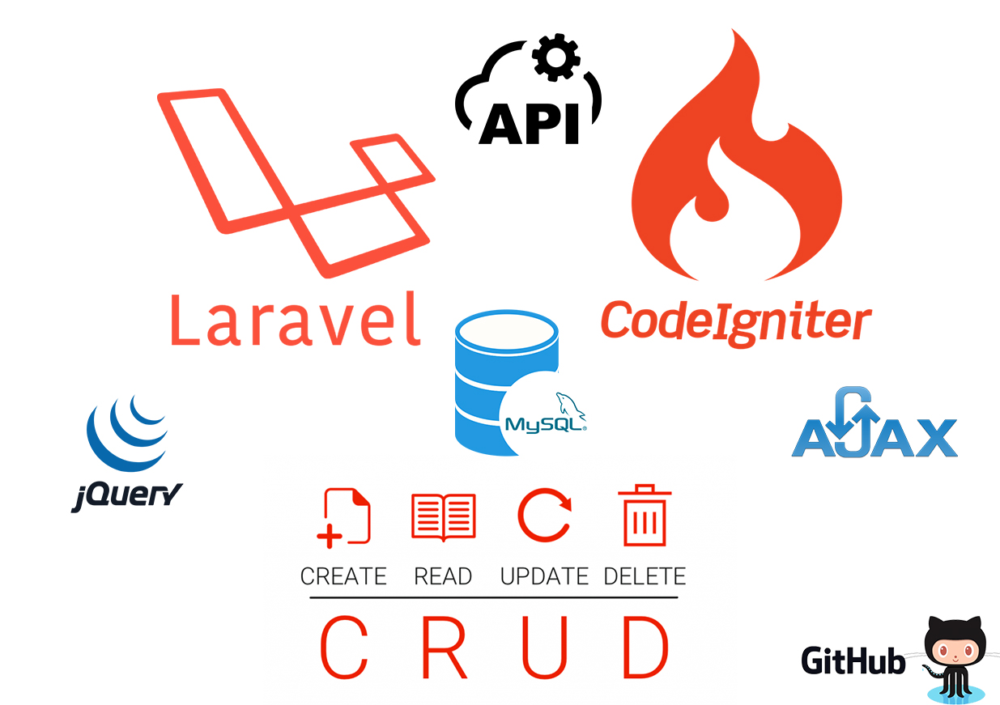

# crud
>This project about that crud (create, read, update, delete) in "Laravel" and "Codeigniter" php framework. In this project I use jquery, Ajax, Rest API etc.

 
# crud installation.
>First clone this repository for command: 
<code>$ git clone https://github.com/JoneCoder/crud.git</code> 
>Second change the directory this command: 
<code>$ cd laravel/</code> or <code>$ cd codeigniter/</code> 
>Than copy the .env.example file to .env flowing command: 
<code>$ cp .env.example .env</code> 
>Now update composer for install laravel vendor: 
<code>$ composer update</code> 
>If composer updating done than you generate application key for this command: 
<code>$ php artisan key:generate</code> 
>The next step is create a database in your local xammp server and run the flowing command: 
<code>$ php artisan migrate</code> 
>If you done make a table for file uploads, than run the laravel development server. 
<code>$ php artisan server</code> 
>Get Start crud.
